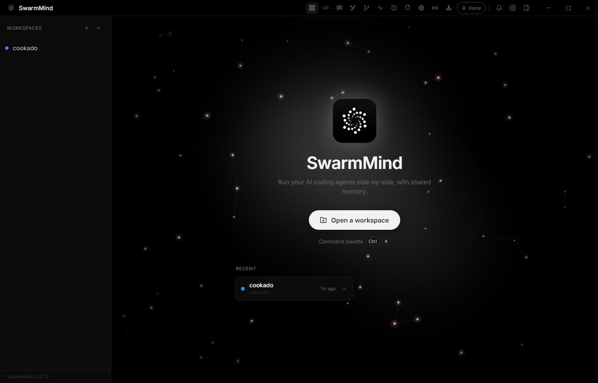

# SwarmMind

[](https://github.com/0xnookie/swarmmind/releases)
[](./LICENSE)
[](https://www.electronjs.org/)
[](https://react.dev/)
[](https://www.typescriptlang.org/)
[](#download)

A desktop workspace that runs multiple AI coding CLI agents side-by-side in resizable terminal panes, coordinated through a shared MCP memory server so agents can exchange context, hand off tasks, and message one another.

Built with Electron + React + TypeScript.



---

## Download

Prebuilt executables for **Windows**, **macOS**, and **Linux** are attached to each [GitHub Release](https://github.com/0xnookie/swarmmind/releases):

- **Windows** — `.exe` installer (NSIS) or portable `.zip`
- **macOS** — `.dmg` (x64 + Apple Silicon; unsigned, so right-click → Open on first launch)
- **Linux** — `.AppImage` (x64)

---

## Features

- **Multi-pane terminals** — split panes horizontally/vertically (Allotment layout); each pane runs a full xterm.js terminal wired to a real PTY.
- **Pluggable agents** — launch Claude Code, Codex, Kilo Code, OpenCode (and other CLIs) per pane.
- **Shared MCP memory** — an embedded Express/SSE MCP server gives every spawned agent `memory_*`, `task_*`, and `send_message` tools so they share a common workspace memory and task queue.
- **Agent-to-agent messaging** — `send_message(to, from, message)` queues directed messages that are delivered into the recipient's running pane.
- **Orchestration (Conductor + Lead)** — an autonomous control loop dispatches a dependency-aware task queue to worker panes, with `off` / `assisted` / `auto` modes. A designated *lead* pane can decompose a goal into tasks and synthesize results.
- **Broadcast & pipe** — send one prompt to many panes at once, or pipe one pane's output into shared memory or other panes.
- **Session resume** — reopening a workspace relaunches each pane's agent *and* restores its prior conversation automatically.
- **Worktree review** — per-pane git worktree isolation, with a diff viewer to commit/merge/discard each agent's work safely.
- **Memory graph & Kanban** — visualize agents, memory entries, and tasks as a force-directed graph, or manage tasks on a board.
- **Question-gated notifications** — agents ping you (bell + OS notification) only when they're actually blocked waiting on an answer.
- **Encrypted secrets** — agent API keys are encrypted at rest via Electron `safeStorage`.
- **Built-in file explorer + editor** (CodeMirror) and a command palette (`Ctrl/⌘-K`).

---

## Prerequisites

- **Node.js** 20+ (developed on 22.x)
- Install the agent CLIs you want to use:
  - **Claude Code**: `npm install -g @anthropic-ai/claude-code`
  - **Codex**: `npm install -g @openai/codex`
  - **Kilo Code**: see [kilocode.ai](https://kilocode.ai)
  - **OpenCode**: `npm install -g opencode-ai`

---

## Development

```bash
npm install        # also runs postinstall (copies ONNX Runtime WASM into public/ort)
npm run dev        # electron-vite dev server with HMR
```

### Type checking (the correctness gate)

There is no test suite; TypeScript is the primary correctness gate.

```bash
npm run typecheck  # tsc --noEmit over tsconfig.web.json and tsconfig.node.json
```

### Native modules

`node-pty` and `better-sqlite3` are native addons. After upgrading Electron, recompile them:

```bash
npm run rebuild
```

---

## Production build

```bash
npm run build      # outputs to out/
npm run dist       # packages an installer into dist/
```

On Windows, `npm run dist` produces an NSIS installer (`dist/SwarmMind-x.y.z-win-x64.exe`) and a portable `.zip`.

---

## How it works

1. **Open a workspace** — select a project folder via `File → Open Workspace` (or `Ctrl+O`).
2. **Add panes** — right-click a pane title bar for `Split Right` / `Split Down`.
3. **Select an agent** — click the agent name in the pane header to choose Claude Code, Codex, Kilo Code, or OpenCode.
4. **Spawn** — press `▶` to launch the agent in that pane.
5. **Shared memory** — spawned agents auto-connect to the embedded MCP server. Use `memory_write`, `task_create`, etc. inside any agent to share context.
6. **Memory panel** — click `Memory` in the toolbar to open the live memory/task sidebar and graph.

---

## MCP tools available to agents

| Tool | Description |
|---|---|
| `memory_read(key)` | Read a shared value |
| `memory_write(key, value, type)` | Write a value |
| `memory_delete(key)` | Delete a value |
| `memory_list()` | List all keys |
| `task_create(title, description?, assigned_agent?, depends_on?)` | Create a task |
| `task_update(id, status)` | Update task status |
| `task_get(id)` | Full task detail |
| `task_list()` | List tasks |
| `task_note(id, note)` | Append a timestamped progress note |
| `send_message(to, from, message)` | Queue a directed agent→agent message |

## MCP resources

| URI | Content |
|---|---|
| `swarmmind://project_context` | All context-type memory entries |
| `swarmmind://task_list` | Current task queue |
| `swarmmind://conversation_history/{agentId}` | History for a specific agent |

---

## Architecture

```
electron/     Main process — PTY spawning, git/worktree manager, IPC, secrets, MCP injection
mcp/          Embedded Express/SSE MCP server, tools, and resources
memory/       Dual better-sqlite3 databases (app + per-workspace) and query helpers
src/          React renderer — panes, terminals, overlays, Zustand store
```

- The renderer and main process are strictly isolated via `contextBridge`; the entire IPC surface is exposed as `window.swarmmind`.
- Two SQLite databases: `app.db` (workspaces, skills, app state) and a per-workspace `.swarmmind/memory.db` (memory, tasks, layouts, messages).
- On Windows, `node-pty` cannot spawn `.cmd` scripts directly, so every agent command is wrapped in the user's selected shell (PowerShell / cmd / bash).

See [`CLAUDE.md`](./CLAUDE.md) for a deeper architecture reference.

---

## Keyboard shortcuts

| Shortcut | Action |
|---|---|
| `Ctrl+O` | Open workspace |
| `Ctrl/⌘+K` | Command palette |
| `Ctrl/⌘+B` | Broadcast bar |
| `Ctrl+F` | Terminal search (per pane) |

---

## License

[MIT](./LICENSE)
