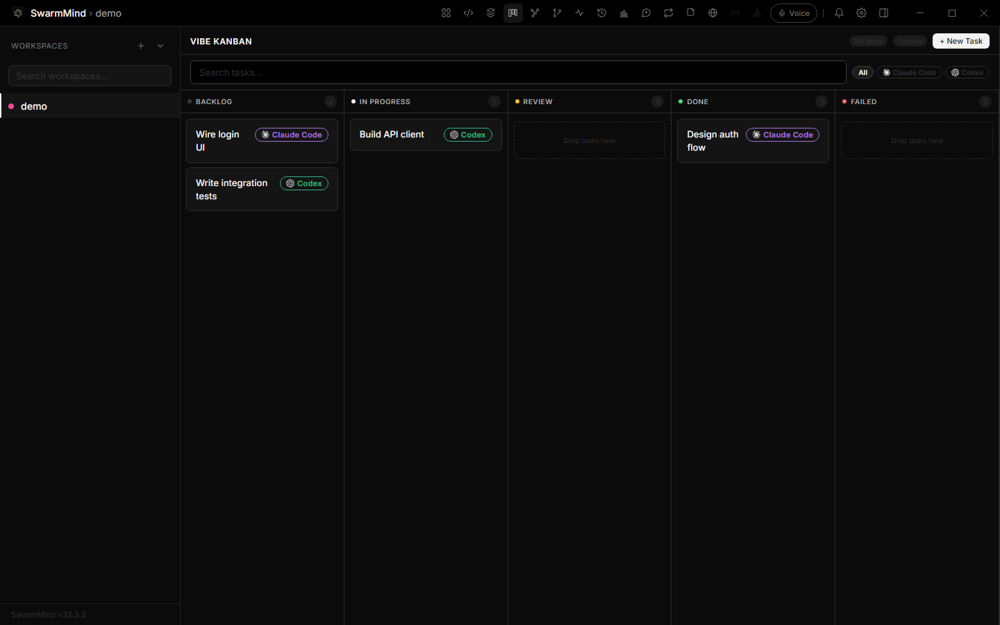
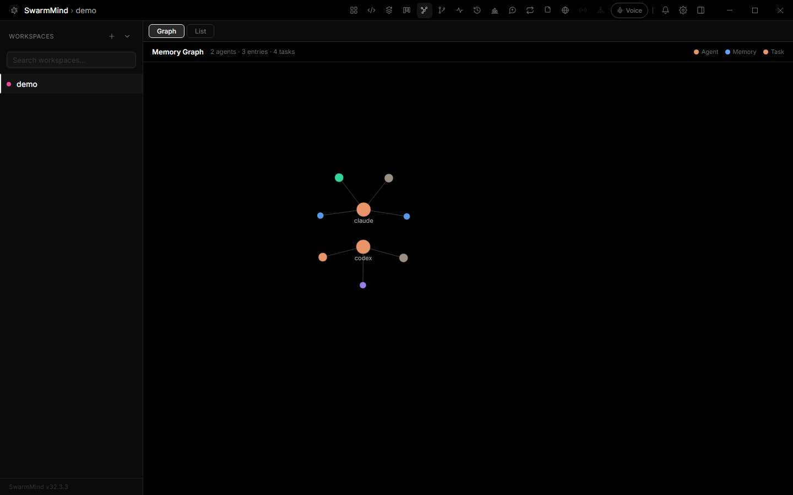
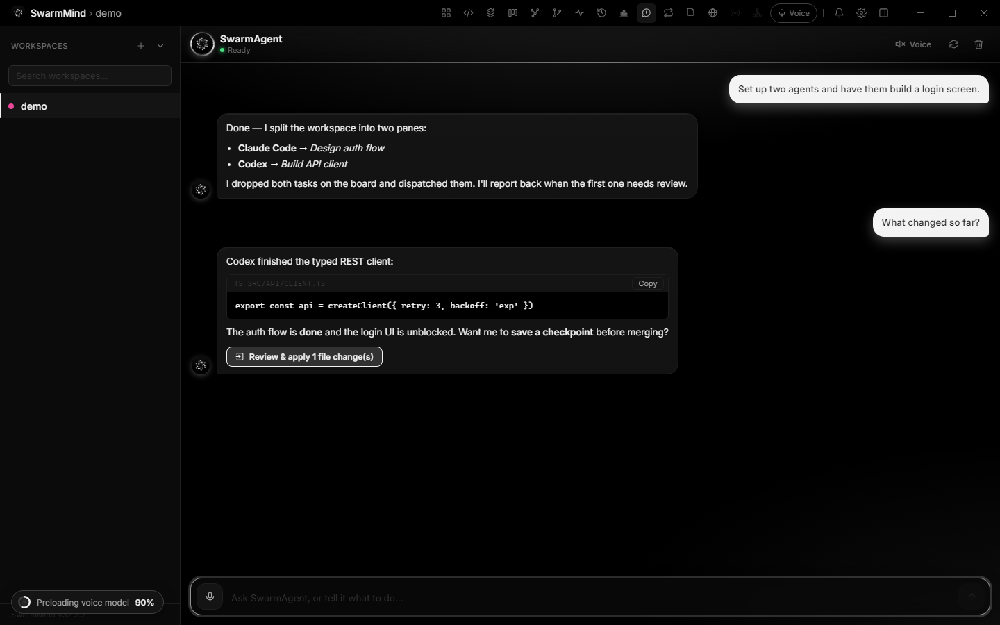
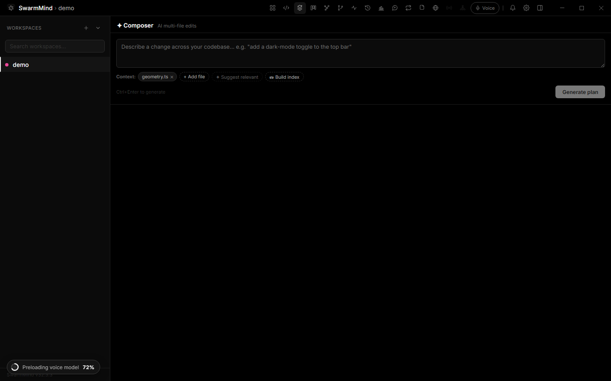
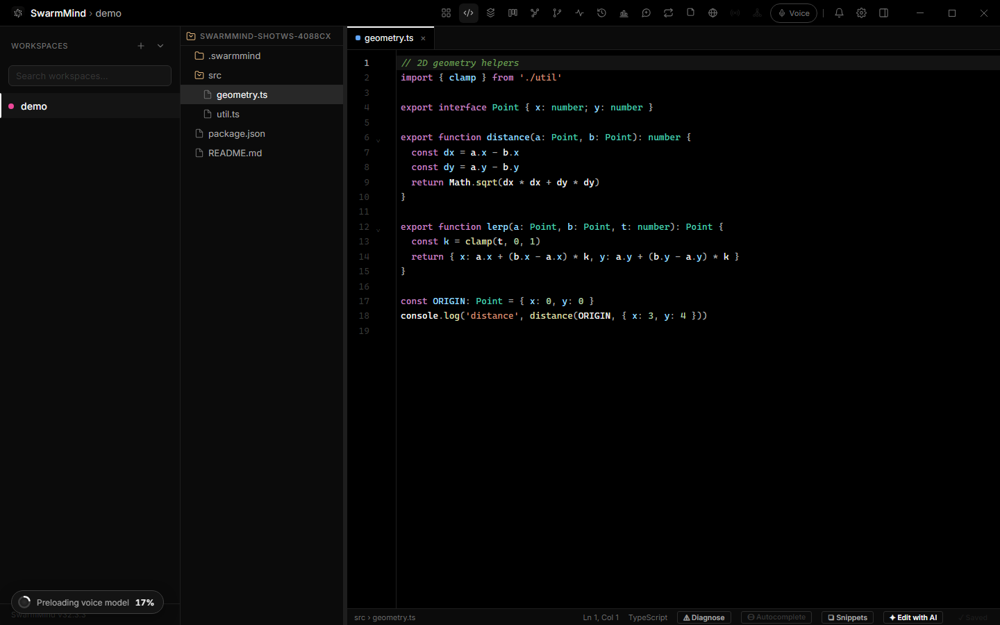

# SwarmMind

[](https://github.com/0xnookie/swarmmind/releases)
[](./LICENSE)
[](https://www.electronjs.org/)
[](https://react.dev/)
[](https://www.typescriptlang.org/)
[](#download)

A desktop workspace that runs multiple AI coding CLI agents side-by-side in resizable terminal panes, coordinated through a shared MCP memory server so agents can exchange context, hand off tasks, and message one another — plus an in-app AI assistant and a full Cursor-style AI editor to drive it all.

Built with Electron + React + TypeScript.


---

## Download

Prebuilt executables for **Windows**, **macOS**, and **Linux** are attached to each [GitHub Release](https://github.com/0xnookie/swarmmind/releases):

- **Windows** — `.exe` installer (NSIS) or portable `.zip`
- **macOS** — `.dmg` (x64 + Apple Silicon; unsigned, so right-click → Open on first launch)
- **Linux** — `.AppImage` (x64)

---

## Features

### Run a swarm of agents

- **Multi-pane terminals** — split panes horizontally/vertically (Allotment layout); each pane runs a full xterm.js terminal wired to a real PTY. Per-pane title, colour, search (`Ctrl-F`), and a themed start animation while a shell spins up.
- **Pluggable agents** — launch Claude Code, Codex, Cursor, Windsurf, Kilo Code, OpenCode, Cline (and other CLIs) per pane, each shown with its real brand logo across the whole UI.
- **Multiple accounts per agent** — connect several Claude / Codex / OpenCode accounts (via the CLI's own browser sign-in — *no API key needed*) and switch between them in a click when one hits a usage limit. Active account applies to every terminal, even ones you start by hand.
- **Session resume** — reopening a workspace relaunches each pane's agent *and* restores its prior conversation automatically.
- **Broadcast & pipe** — send one prompt to many panes at once (`Ctrl/⌘-B`), or pipe one pane's output into shared memory or other panes.

### Shared brain (MCP)

- **Shared MCP memory** — an embedded Express/SSE MCP server gives every spawned agent `memory_*`, `task_*`, and `send_message` tools so they share a common workspace memory and task queue.
- **Agent-to-agent messaging** — `send_message(to, from, message)` queues directed messages that are delivered into the recipient's running pane.
- **Memory graph & Kanban** — visualize agents, memory entries, and tasks as a force-directed graph, or manage tasks on a board with dependencies, search, agent filters, and progress.
- **Question-gated notifications** — agents ping you (bell + OS notification) only when they're actually blocked waiting on an answer, never just for finishing a turn.



### Orchestration

- **Conductor + Lead** — an autonomous control loop dispatches a dependency-aware task queue to worker panes, with `off` / `assisted` / `auto` modes. A designated *lead* pane can decompose a goal into tasks and synthesize the results once they finish. It spends **zero** model tokens — the code does the wiring, the panes do the thinking.
- **Loops** — save a prompt and have SwarmMind re-inject it into a chosen pane (or all running agents) every *N* seconds, with run counts, countdowns, and pause/resume.



### SwarmAgent — the in-app AI assistant

- **Chat + voice assistant that drives the app.** Ask it to "open a workspace with 4 agents", "tell Claude to run the tests and report back", or "what did the agents change?" and it acts — setting up panes, broadcasting or targeting prompts, reading terminal output, managing tasks and memory, navigating views, and running the orchestrator. Streaming replies, voice in/out, persisted history, Stop, and Regenerate.
- **Snapshot, review & land work.** "Snapshot this before the refactor" saves a checkpoint; "rewind" rolls the whole workspace back (undoably); "land the backend work" merges an agent's worktree branch (committing loose changes first, aborting cleanly on conflict).
- **Markdown replies & one-click apply.** Answers render as proper Markdown with fenced code blocks; when a reply contains file-targeted code blocks, a **Review & apply** button opens the Composer directly on those exact blocks.
- **Desktop widget** — a small frameless, always-on-top floating chat bar so the assistant stays reachable when the main window is minimized or in the tray. It matches your theme, supports voice, grows from a slim bar into a transcript as you chat, and pulses when an agent needs you.



### Cursor-style AI editor

A built-in CodeMirror editor (syntax highlighting for ~150 languages, image viewer, snippets) with a full in-editor AI suite:

- **Multi-file Composer** — describe a change in plain language and the AI proposes coordinated edits across several files; preview per-file diffs with a checkbox each, take a one-click **safety checkpoint**, then apply. **✦ Suggest relevant** auto-selects context files via hybrid BM25 + on-device semantic embeddings (key-free, offline-capable); **Build index** embeds the whole repo for repo-wide retrieval.
- **Inline AI edit — `Ctrl/⌘-K`** — select code (or place the cursor) and describe a change; the result streams in as an accept / reject / regenerate preview. Supports **@-mention file context**.
- **Tab-to-jump** — after an accepted inline edit, the editor predicts the likely follow-up and shows a **Tab** chip to chain related edits.
- **Ghost-text autocomplete — Tab** — Copilot-style inline completions as you pause typing (off by default).
- **AI diagnostics & "Fix with AI"** — a **Diagnose** button flags problems as editor underlines/gutter markers, each with a one-click fix that opens the inline-edit widget pre-filled.
- **Rename symbol — F2** — renames an identifier across the workspace through the Composer pipeline, skipping strings, comments, and substring matches.
- **Verify → fix loop** — after applying a plan, run one of your repo's own npm scripts (typecheck/test/lint/build); on failure, **Fix errors with AI** condenses the output and re-runs the plan so the model fixes its own change. The runner only ever executes an allowlisted script already declared in your `package.json`.



### Git, safety & polish

- **Worktree review** — per-pane git worktree isolation, with a diff viewer to commit (all or per-file), merge, or discard each agent's work safely.
- **Checkpoints** — workspace-wide snapshots you can create, list, and restore (rewinds are themselves snapshotted, so they're undoable).
- **Encrypted secrets** — agent API keys are encrypted at rest via Electron `safeStorage`; untrusted-workspace config that affects spawning is signed and dropped unless it verifies.
- **SwarmVoice** — push-to-talk dictation into the active pane via a local Whisper model (with download/warm-up progress).
- **Benchmarks leaderboard** — ranks today's coding agents/models on the Artificial Analysis Coding Agent Index, refreshing live and working offline from a bundled snapshot.
- **Command palette** (`Ctrl/⌘-K`) reaching every view, with match-highlighting and most-used recall — and **EN / DE** localization throughout.



---

## Prerequisites

- **Node.js** 20+ (developed on 22.x)
- Install the agent CLIs you want to use:
  - **Claude Code**: `npm install -g @anthropic-ai/claude-code`
  - **Codex**: `npm install -g @openai/codex`
  - **Kilo Code**: see [kilocode.ai](https://kilocode.ai)
  - **OpenCode**: `npm install -g opencode-ai`
- *(Optional)* A **Groq API key** powers the SwarmAgent assistant and the in-editor AI features — set it in Settings → General.

---

## Development

```bash
npm install        # also runs postinstall (copies ONNX Runtime WASM into public/ort)
npm run dev        # electron-vite dev server with HMR
```

### Type checking & tests (the correctness gate)

TypeScript is the primary correctness gate. Pure, risky logic is extracted into dependency-free `lib/` modules with committed unit assertions.

```bash
npm run typecheck  # tsc --noEmit over tsconfig.web.json and tsconfig.node.json
npm test           # node --experimental-strip-types tests/lib-units.mts (Node 22+)
```

### Native modules

`node-pty` and `better-sqlite3` are native addons. After upgrading Electron, recompile them:

```bash
npm run rebuild
```

---

## Production build

```bash
npm run build      # outputs to out/
npm run dist       # packages an installer into dist/
```

On Windows, `npm run dist` produces an NSIS installer (`dist/SwarmMind-x.y.z-win-x64.exe`) and a portable `.zip`.

---

## How it works

1. **Open a workspace** — select a project folder via `File → Open Workspace` (or `Ctrl+O`).
2. **Add panes** — right-click a pane title bar for `Split Right` / `Split Down`.
3. **Select an agent** — click the agent name in the pane header to choose Claude Code, Codex, Kilo Code, or OpenCode.
4. **Spawn** — press `▶` to launch the agent in that pane.
5. **Shared memory** — spawned agents auto-connect to the embedded MCP server. Use `memory_write`, `task_create`, etc. inside any agent to share context.
6. **Or just ask** — open the SwarmAgent assistant (`Ctrl/⌘-Shift-A`) and tell it what you want; it sets up agents, dispatches work, and reviews it for you.

---

## MCP tools available to agents

| Tool | Description |
|---|---|
| `memory_read(key)` | Read a shared value |
| `memory_write(key, value, type)` | Write a value |
| `memory_delete(key)` | Delete a value |
| `memory_list()` | List all keys |
| `task_create(title, description?, assigned_agent?, depends_on?)` | Create a task |
| `task_update(id, status)` | Update task status |
| `task_get(id)` | Full task detail |
| `task_list()` | List tasks |
| `task_note(id, note)` | Append a timestamped progress note |
| `send_message(to, from, message)` | Queue a directed agent→agent message |

## MCP resources

| URI | Content |
|---|---|
| `swarmmind://project_context` | All context-type memory entries |
| `swarmmind://task_list` | Current task queue |
| `swarmmind://conversation_history/{agentId}` | History for a specific agent |

---

## Architecture

```
electron/     Main process — PTY spawning, git/worktree manager, IPC, secrets, MCP injection
mcp/          Embedded Express/SSE MCP server, tools, and resources
memory/       Dual better-sqlite3 databases (app + per-workspace) and query helpers
src/          React renderer — panes, terminals, overlays, AI editor, Zustand store
```

- The renderer and main process are strictly isolated via `contextBridge`; the entire IPC surface is exposed as `window.swarmmind`.
- Two SQLite databases: `app.db` (workspaces, skills, app state) and a per-workspace `.swarmmind/memory.db` (memory, tasks, layouts, messages).
- The MCP SSE endpoint is gated on a per-workspace bearer token so only agents SwarmMind spawns can reach it.
- On Windows, `node-pty` cannot spawn `.cmd` scripts directly, so every agent command is wrapped in the user's selected shell (PowerShell / cmd / bash) with each argv token shell-quoted.

See [`CLAUDE.md`](./CLAUDE.md) for a deeper architecture reference.

---

## Keyboard shortcuts

| Shortcut | Action |
|---|---|
| `Ctrl+O` | Open workspace |
| `Ctrl/⌘+K` | Command palette (or **inline AI edit** when focus is in the editor) |
| `Ctrl/⌘+Shift+A` | Toggle the SwarmAgent assistant |
| `Ctrl/⌘+B` | Broadcast bar |
| `Ctrl+F` | Terminal search (per pane) |
| `F2` | Rename symbol across files (in the editor) |
| `Tab` | Accept ghost-text / jump to next predicted edit (in the editor) |

---

## License

[MIT](./LICENSE)
